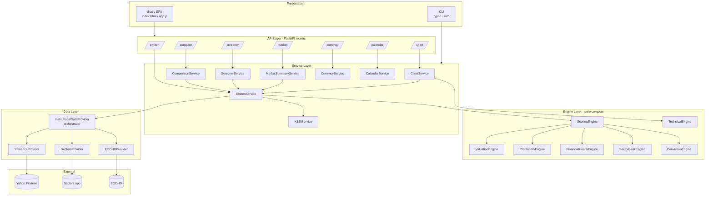
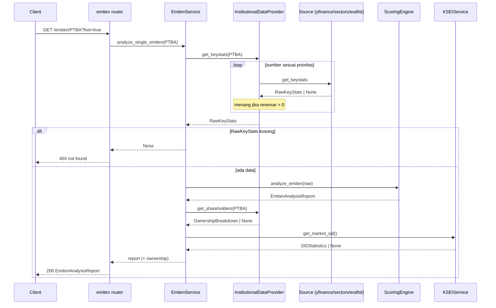
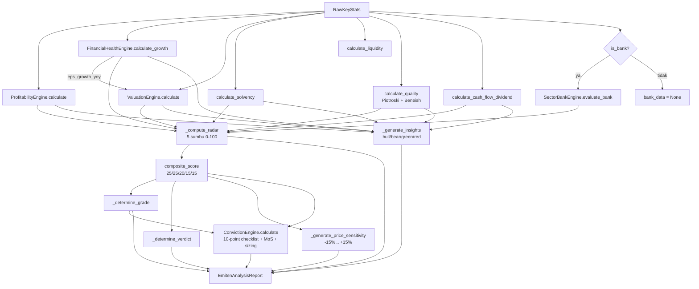
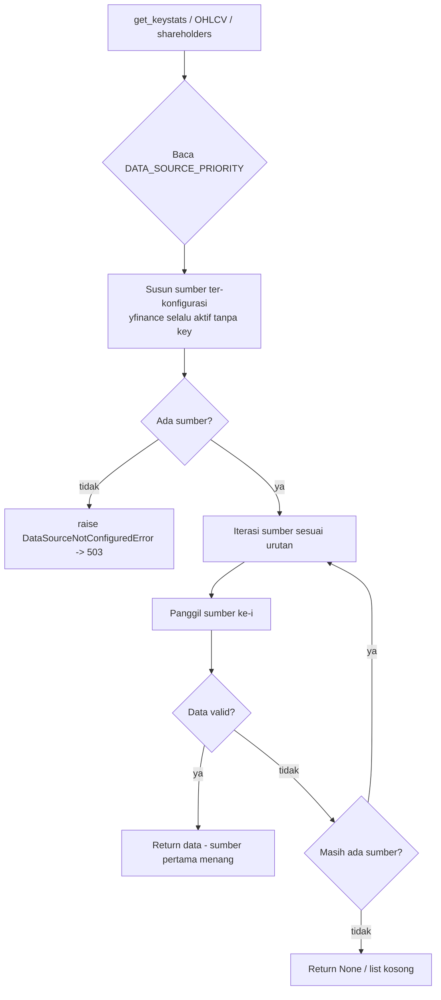
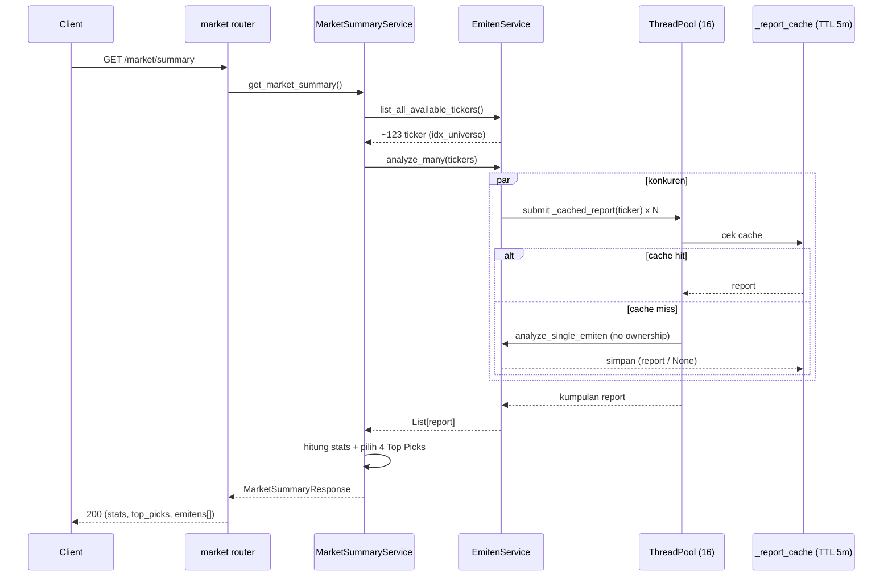
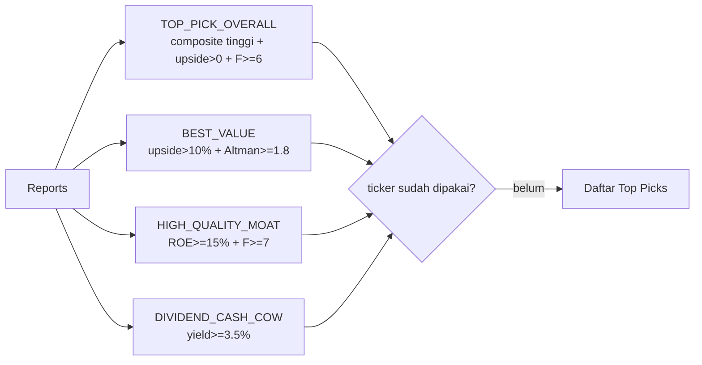
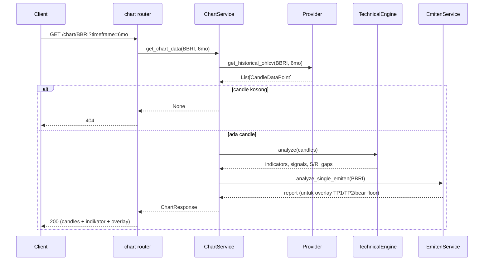
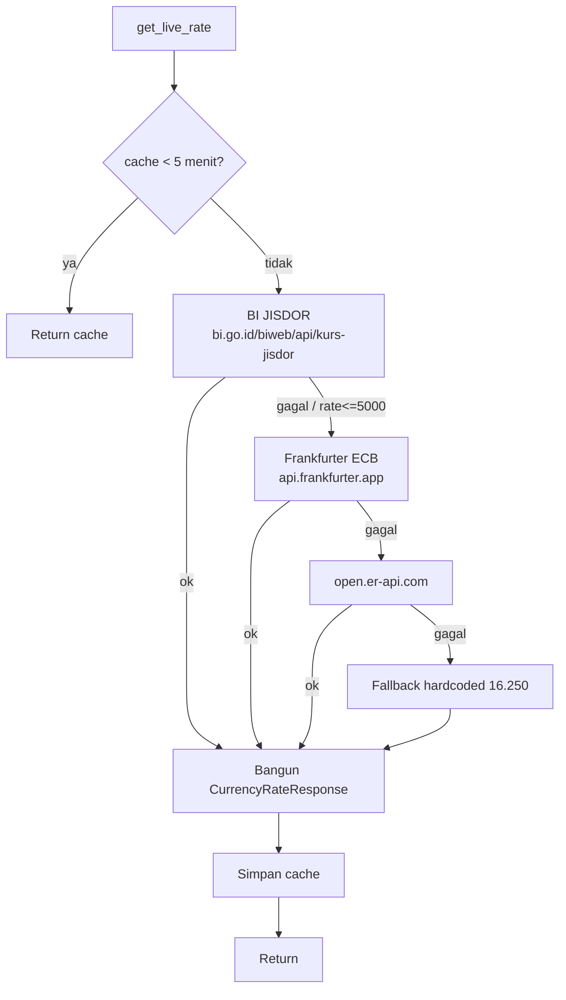
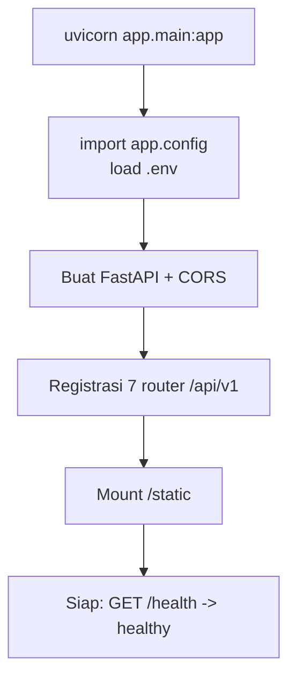
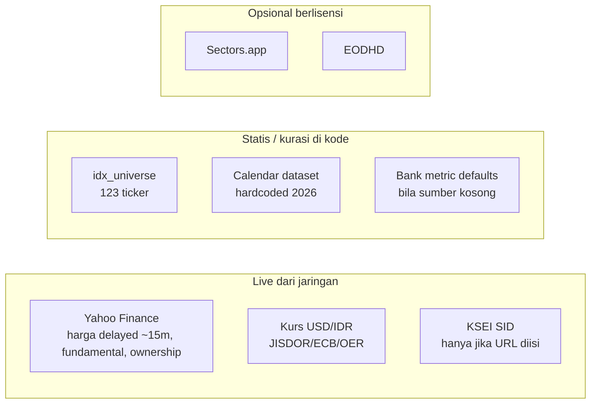

# BRIGHTS — Flowcharts & Diagram Alur

> Diagram runtime memakai sintaks [Mermaid](https://mermaid.js.org/) (dirender otomatis di
> GitHub, VS Code + ekstensi Mermaid, dan banyak viewer Markdown). Untuk komponen statis lihat
> [TOPOLOGY.md](./TOPOLOGY.md); untuk formula lihat [SYSTEM_DESIGN.md](./SYSTEM_DESIGN.md).

---

## 1. Arsitektur berlapis (high-level)

---

## 2. Analisis emiten tunggal — `GET /emiten/{ticker}`

---

## 3. Pipeline scoring internal (ScoringEngine.analyze_emiten)

---

## 4. Resolusi sumber data (InstitutionalDataProvider)

---

## 5. Market summary & Top Picks — `GET /market/summary`

Pemilihan Top Picks (4 kategori distinct):

---

## 6. Chart — `GET /chart/{ticker}`

---

## 7. Currency — fallback berjenjang

> Catatan: field `source` bisa berlabel "Bank Indonesia JISDOR ..." meski data dari sumber
> sekunder/fallback (branding, bukan jaminan sumber).

---

## 8. Startup aplikasi

---

## 9. Boundary data eksternal (apa live vs statis)

